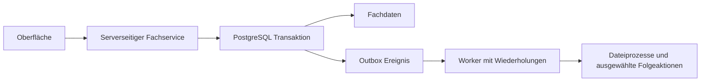

# DigitalMask Architektur und Implementierungsplan

Stand: 30. September 2026. Dieses Dokument hält die ursprüngliche Architekturplanung für die Maske am Stadttheater Ingolstadt fest. Alle Zusatzfeatures wurden anschließend beauftragt. Die tatsächlich umgesetzte Struktur und Betriebsregeln stehen in README.md und docs/BETRIEB.md; die folgenden Planungstabellen sind keine Behauptung, dass jede ursprünglich erwogene Bibliothek oder Tabelle eingesetzt wurde.

## Tatsächliche Umsetzung

Die Anwendung verwendet Next.js/React/TypeScript, npm-Lockfile, eigene zugängliche UI-Komponenten mit Tailwind/CSS-Tokens, FullCalendar Standard, dnd-kit, Better Auth, Zod, Drizzle, Neon und privaten Vercel Blob. TanStack Query/Table, shadcn/ui und ein separater Backenddienst waren Optionen im Plan und sind für den aktuellen Funktionsumfang nicht erforderlich. Die Datenzugriffe liegen ausschließlich im Backend.

Identitäten, Rollenmitgliedschaften, Organisationen, Gewerke, persönliche Profileinstellungen, getrennte Anwesenheits-/Arbeitstimer, Dokumentversionen, Audit und Outbox sind eigene relationale Tabellen. Fachdaten nutzen einen je Art validierten Record-Speicher mit indizierten relationalen Scope-/Projekt-/Person-/Zeitspalten und JSONB-Nutzdaten. Das tatsächlich migrierte Schema ist src/platform/db/schema.ts. Beziehungen werden in den Fachservices geprüft; zusammengesetzte Scope-Fremdschlüssel und eindeutige Zeit-/Wochenindizes schützen zusätzlich in PostgreSQL. Kontaktverzeichnis, fachliche Kategorien, private Chatgruppen und wiederholbare Dokumentfelder sind eigene validierte Record-Arten bzw. klar definierte Datenstrukturen.

Hintergrundverarbeitung läuft nach relevanten Schreibzugriffen über Next.js `after`; ein täglicher Cron übernimmt Recovery. Ein dauerhaft laufender Broker oder ein häufiger Cron ist dafür nicht erforderlich. Das Outboxmodell liefert mindestens einmal und verwendet idempotente Notification-IDs, Leasing und begrenzte Wiederholungen. Fehlgeschlagene Aufträge bleiben mit Status `failed` in der Outbox; eine eigene technische Admin-Konsole ist derzeit nicht umgesetzt.

Die Anwendung zeigt pro Sitzung ein Gewerk. Das Schema ermöglicht weitere Organisationen und Gewerke; Gewerkwechsel und organisationsübergreifende Katalogfreigaben sind Erweiterungspunkte. Kalenderkategorien sowie Material-, Zeit- und Dokumentationskategorien sind verwaltbar. Kalender enthält die ganztägigen Standards Krank, ABF, Ruhetag, halber freier Tag und Urlaub; der halbe freie Tag lässt einen zeitlich geplanten Dienst zu. Unleserliche Excel-Kürzel werden nicht geraten. Backups und Anbieterbudgetalarme sind betriebliche Einstellungen und werden in docs/BETRIEB.md erläutert.

Empfehlung: eine modulare Next.js-Anwendung mit PostgreSQL, privatem Dateispeicher und gezielt eingesetzten, zuverlässig verarbeiteten Ereignissen. Fachmodule trennen Oberfläche, Geschäftslogik und Datenzugriff. Weitere Gewerke können dieselbe Plattform verwenden.

## Ausgangslage und Annahmen

- GitHub und lokales Repository sind leer; es gibt noch keinen Commit und keine bestehende Anwendung.
- Die vorliegenden Fotos dienen als fachliche Referenz. Personenangaben und Originalbilder werden nicht in das öffentliche Repository übernommen.
- Das Kalenderfoto zeigt eine dichte, farbcodierte Planung mit zwei nebeneinander angeordneten Rasterabschnitten. Kleine Beschriftungen, Farblegende, Kürzel und exakte Zeitraster sind nicht zuverlässig lesbar. Die Software erhält konfigurierbare Kategorien; eine exakte Übernahme der Legende bleibt offen.
- Der Stundenzettel enthält Person, Kalenderwoche, Montag bis Sonntag, Tätigkeit, Produktion, Einzelstunden, Tageswerte und Wochensumme. Allgemeine Arbeiten wie Büro und Aufräumen müssen ohne Produktionszuordnung erfassbar sein.
- Kalenderplanung und tatsächlich gebuchte Arbeitszeit sind unterschiedliche Datensätze. Ein geplanter Dienst erzeugt keine geleisteten Stunden.
- Oberfläche zunächst Deutsch; Zeitzone Europe/Berlin, Wochenbeginn Montag und ISO-Kalenderwochen. Sprachtexte werden zentral organisiert.
- Zunächst eine Organisation Stadttheater Ingolstadt und das Gewerk Maske. Organisationen und Gewerke sind im Datenmodell eigenständig.
- Diese Phase liefert den Plan. Infrastruktur, erster Anwendungscode und Deployment folgen in den beschriebenen Umsetzungsschritten.

## Technologiestack

| Bereich           | Geplante Technik                                                             | Zweck                                                                 |
| ----------------- | ---------------------------------------------------------------------------- | --------------------------------------------------------------------- |
| Anwendung         | Next.js App Router, React, TypeScript strict                                 | Gemeinsame Plattform für Oberfläche und serverseitige Anwendung       |
| Laufzeit          | Unterstützte Node.js LTS, Vercel Functions                                   | Deployment und Betrieb                                                |
| Design            | Tailwind CSS, shadcn/ui mit zugänglichen Primitives, semantische CSS-Tokens  | Einheitliche Komponenten, Light und Dark Mode                         |
| Formulare         | React Hook Form und Zod                                                      | Gute Eingabeoberfläche und gemeinsame Validierung                     |
| Interaktive Daten | TanStack Query nach Bedarf                                                   | Aktualisierung, Pagination und kontrollierte optimistische Änderungen |
| Tabellen          | TanStack Table                                                               | Sortierung, Filter und Auswertungen                                   |
| Kalender          | FullCalendar Standard und eigenes Teamraster                                 | Monat, Woche, Tag, Agenda und kompakte Teamplanung                    |
| Kanban            | dnd-kit mit zusätzlicher Aktion zum Verschieben                              | Bedienung mit Maus, Touch und Tastatur                                |
| Datenbank         | PostgreSQL bei Neon über Vercel Marketplace                                  | Relationale Daten, Transaktionen, Indizes und Auswertungen            |
| Datenzugriff      | Drizzle ORM und versionierte SQL-Migrationen                                 | Typsicherer Zugriff bei nachvollziehbarem Datenbankschema             |
| Authentifizierung | Better Auth und Username-Plugin                                              | Registrierung, Passwortprüfung und serverseitige Sitzungen            |
| Dateien           | Privater Vercel Blob Store                                                   | Figurenbilder, Schauspielerbilder und Anhänge                         |
| Ereignisse        | PostgreSQL Outbox und begrenzte Worker-Aufrufe                               | Wiederholbare Hintergrundverarbeitung                                 |
| Tests             | Vitest, Testing Library, Playwright, automatisierte Zugänglichkeitsprüfungen | Geschäftsregeln, wichtige Abläufe und mobile Bedienung                |
| Entwicklung       | pnpm, ESLint, Prettier, GitHub Actions                                       | Reproduzierbare Installation und automatisierte Prüfungen             |

Zum Implementierungsbeginn werden die aktuellen kompatiblen stabilen Versionen und Sicherheitspatches geprüft und per Lockfile festgehalten. Neue experimentelle Framework-Funktionen sind keine Voraussetzung.

Vercel stellt PostgreSQL über Marketplace-Anbieter bereit; das frühere Vercel Postgres ist nicht mehr als neues Produkt verfügbar. Neon ist hier die geplante Integration. FullCalendar-Ressourcenansichten gehören zu Premium und haben eine eigene Lizenz. Deshalb entsteht die kompakte Teamübersicht zunächst als eigenes Raster auf denselben Kalenderdaten.

## Modulgrenzen und Codeaufbau

Die Anwendung wird als modularer Monolith betrieben: ein Deployment mit klar abgegrenzten Fachmodulen. Die Oberfläche ruft serverseitige Dienste auf. Geschäftsregeln befinden sich in diesen Diensten; Repository-Funktionen kapseln SQL-Abfragen. Route Handler und Server Actions sind schmale Eingangspunkte. Spätere Integrationen können dieselben Dienste über eine versionierte HTTP-API aufrufen.

```text
src/
  app/                     Routen, Layouts und HTTP-Eingangspunkte
  modules/
    identity/              Registrierung, Sitzungen, Rollen
    organization/          Theater, Gewerke und Mitgliedschaften
    productions/           Stücke, Produktionen, Projektmitglieder
    planning/              Sprints, Aufgaben, Unteraufgaben, Checklisten
    people/                Schauspieler, Figuren und Besetzungen
    documentation/         Aufschriebe, Vorlagen und Versionen
    calendar/              Dienste, Termine, Teilnehmende, Freiwünsche
    time-tracking/         Timer, Zeitbuchungen und Stundenberichte
    communication/         Projektchats und Abteilungskanal
    files/                 Uploads, Zugriff und Löschprozesse
  components/ui/           Gemeinsames Designsystem
  platform/
    auth/                  Auth-Integration
    db/                    Verbindung und Transaktionskontext
    permissions/           Zentrale Berechtigungsprüfung
    events/                Ereignisschemata, Outbox und Verarbeitung
    observability/         Strukturierte Logs und Fehlerberichte
  shared/                  Tatsächlich gemeinsam verwendete Hilfsfunktionen
drizzle/                   Datenbankmigrationen
tests/                     Integration und End-to-End
docs/                      Architektur und Betrieb
```

Ein Fachmodul enthält nach Bedarf domain, application, infrastructure und ui. Die Datenbankschemata werden pro Fachmodul definiert; der zentrale Migrationsprozess führt sie zusammen. Abhängigkeiten laufen über veröffentlichte Modulinterfaces. Ein gemeinsamer Transaktionskontext erlaubt atomare Änderungen über mehrere Tabellen. Ein zusätzliches Backend-Deployment wird erst nötig, wenn Last oder Integrationen es rechtfertigen.

## Event Driven Architecture

Ereignisse ergänzen die Anwendung. Kritische Regeln laufen synchron: Rechteprüfung, Speichern einer Buchung, Stundenberechnung, Kalenderkonflikte und Genehmigung eines Freiwunsches. Die Oberfläche erhält direkt eine verlässliche Bestätigung.

Beispiele für versionierte Ereignistypen sind TaskAssignedV1, LeaveRequestApprovedV1, TimeEntryCreatedV1, LookSheetPublishedV1 und FileDeletionRequestedV1. Sie können optionale Benachrichtigungen, Integrationen und nachgelagerte Verarbeitung auslösen. Eine Genehmigung und ihr Abwesenheitseintrag werden dagegen bereits in derselben fachlichen Transaktion gespeichert.



Fachdaten und Outbox-Zeile werden atomar geschrieben. Ein Ausfall zwischen Speichern und Verarbeitung verliert damit kein Ereignis. Ein Cron-Aufruf übernimmt begrenzte Batches; mehrere Worker beanspruchen Aufträge atomar mit Lease und Sperrmechanismus. Netzwerkaufrufe erfolgen außerhalb lang laufender Datenbanktransaktionen.

Die Zustellung erfolgt mindestens einmal. Jeder Handler verwendet deshalb einen eindeutigen Schlüssel aus Ereignis und Handler sowie idempotente Änderungen. Es gibt exponentielle Wiederholungen, eine maximale Versuchszahl, einen sichtbaren Fehlerzustand und kontrolliertes erneutes Ausführen. Aggregate erhalten Versionsnummern, wenn Reihenfolge wichtig ist. Ereignisse enthalten IDs, Typ, Schemaversion, Organisation, Gewerk, Zeitpunkt und Korrelations-ID; sensible Notiztexte und Bilder werden nicht dupliziert.

Der Worker läuft ausschließlich serverseitig und ist mit einem Secret geschützt. Vercel Pro erlaubt häufigere Cron-Aufrufe; Hobby ist für Cron auf einmal täglich begrenzt. Für zeitnahe Verarbeitung ist deshalb Pro oder eine später geprüfte externe Queue notwendig. Kafka, RabbitMQ, Event Sourcing und eine Aufteilung in viele Microservices sind für den Start nicht erforderlich. Bei wachsender Last kann der Worker hinter demselben Interface auf einen verwalteten Queue-Dienst umgestellt werden.

## Organisationen und Datenmodell

| Modul                    | Wesentliche Datensätze und Beziehungen                                                                                 |
| ------------------------ | ---------------------------------------------------------------------------------------------------------------------- |
| Organisation             | Organization, Department, Membership; eine Person kann mehreren Gewerken angehören                                     |
| Identität                | User, Session, Account; globale Identität mit gewerksbezogenen Mitgliedschaften                                        |
| Stücke und Projekte      | Work als Stück; Production als konkrete Inszenierung bzw. Wiederaufnahme, Saison und ProjectMembership                 |
| Arbeitsplanung           | Sprint mit frei gewählten Datumsgrenzen, BoardColumn, Task, TaskAssignee, Unteraufgabe über parentId und ChecklistItem |
| Schauspieler und Figuren | Actor, ProductionCharacter und CastAssignment; Figur und Schauspieler bleiben getrennt, Doppelbesetzungen sind möglich |
| Aufschriebe              | Template, TemplateVersion, LookSheet, LookSheetVersion und geordnete Bildreferenzen                                    |
| Kalender                 | CalendarEvent, EventParticipant, EventCategory, LeaveRequest und CalendarPreference                                    |
| Zeiterfassung            | TimeEntry, WorkCategory und ActiveTimer; optionale Projekt- und Aufgabenzuordnung                                      |
| Kommunikation            | Channel, ChannelMembership, Message und MessageAttachment                                                              |
| Dateien                  | FileAsset mit Speicherpfad, Eigentümer, fachlichem Bezug und Uploadstatus                                              |
| Betrieb                  | AuditEntry, OutboxEvent und EventDelivery                                                                              |

Fachdaten tragen den passenden Organisations- und Gewerksscope. Gemeinsame Kataloge wie Schauspieler sind organisationsbezogen; Projekt- und Gewerkzugriffe werden separat geprüft. Fremdschlüssel und zusammengesetzte Constraints verhindern Verknüpfungen zwischen fremden Organisationen. Jede serverseitige Operation prüft Scope und Berechtigung.

Strukturierte Kerninformationen stehen in relationalen Spalten. JSONB eignet sich für versionierte Aufschriebfelder und UI-Einstellungen. Suchindizes sowie Indizes auf Organisation, Projekt, Person und Datum unterstützen die häufigen Filter. Geld wird nicht benötigt; Arbeitsdauer wird in ganzen Sekunden gespeichert und in Stunden und Minuten dargestellt. Berichte können zusätzlich Dezimalstunden ausgeben.

Archivieren ist die bevorzugte Aktion für Produktionen mit referenzierten Stunden oder Dokumentation. Endgültiges Löschen prüft Abhängigkeiten und entfernt Bilder über einen wiederholbaren Hintergrundauftrag. Fachlich relevante Änderungen werden nachvollziehbar protokolliert.

## Rollen und Registrierung

| Rolle      | Rechte                                                                                                                                                                                                                                   |
| ---------- | ---------------------------------------------------------------------------------------------------------------------------------------------------------------------------------------------------------------------------------------- |
| Superadmin | Admins bestimmen, zentrale Einstellungen und Feedback verwalten; außerdem Adminrechte                                                                                                                                                    |
| Admin      | Gemeinsame Arbeitsinhalte verwalten, Kalender für andere planen, Kategorien und Zugänge verwalten, Freiwünsche und Wochen freigeben                                                                                                      |
| User       | Zugängliche Produktionen, Kontakte, Schauspieler, Figuren, Besetzungen, Aufgaben, Sprints, gemeinsame Aufschriebe und Vorlagen anlegen und bearbeiten; eigenen Kalender planen, eigene Zeiten buchen, chatten und Freiwünsche beantragen |

Projektbezogene Rechte ergänzen die Gewerkrolle. Die Oberfläche blendet passende Aktionen ein; die verbindliche Prüfung findet immer auf dem Server statt. Persönliche Detailzeiten sind zunächst für die betroffene Person und zuständige Admins sichtbar. Projektstunden werden entsprechend der Projektberechtigung angezeigt. Geteilte Kalender zeigen Verfügbarkeit und erlaubte Dienstdetails; private Abwesenheitsgründe bleiben geschützt.

Die gemeinsame Berechtigungsfunktion in `src/shared/record-permissions.ts` wird von Frontend und Fachservice verwendet. Teammitglieder dürfen gemeinsame Einträge auch löschen, sofern keine abhängigen Zuordnungen bestehen. Sie können nur Kalendertermine mit genau ihrer eigenen Person verändern; Gruppentermine, unzugeordnete Termine und Termine anderer Personen sind Adminaufgaben. Für Wiederaufnahmen prüft der Server die Quellproduktion und kopiert keine fremden privaten Entwürfe.

Die Registrierung bietet Benutzername, Anzeigename und Passwort. Anmeldung erfolgt ausschließlich mit Benutzername und Passwort. Better Auth benötigt intern ein E-Mail-Feld; die Anwendung erzeugt dafür eine eindeutige technische Adresse auf Basis einer unveränderlichen ID unter einer reservierten .invalid-Domain. Diese Adresse wird nicht für Nachrichten oder die Anmeldung angeboten. Direkte alternative Registrierungswege müssen entsprechend gesperrt bzw. auf dieselben Regeln verpflichtet werden. Ein Integrationstest prüft diesen Adapter frühzeitig.

Da keine echte E-Mail vorgesehen ist, erfolgt Passwortwiederherstellung zunächst über einen berechtigten Admin mit einmaligem, kurz gültigem Reset-Code und Widerruf bestehender Sitzungen. Passwörter werden mit dem gepflegten Auth-System gehasht. Login und Registrierung erhalten persistenten Schutz gegen häufige Versuche, sichere Cookies, geprüfte Origins und generische Fehlermeldungen.

Als vorgeschlagene Standardeinstellung können sich Nutzer selbst registrieren, erhalten interne Daten aber erst nach Einladung oder Admin-Freigabe. Diese Einstellung ist noch auswählbar. Niemand kann sich bei Registrierung eine privilegierte Rolle geben. Der erste Superadmin wird durch einen kontrollierten einmaligen Bootstrap angelegt; der erste beliebige registrierte Nutzer wird nicht automatisch Superadmin. Dessen gewünschter Benutzername wird vor Einrichtung benötigt.

## Oberfläche und mobile Nutzung

Die Oberfläche erhält eine ruhige, professionelle Gestaltung mit einer warmen hellen und einer kontrastreichen dunklen Palette, klarer Typografie und einem einzelnen Hauptakzent. Fachliche Farben werden mit Text und Symbolen kombiniert. Light, Dark und Systemmodus sind dauerhaft auswählbar.

Desktop erhält eine seitliche Navigation, eine kompakte Kopfzeile und kontextbezogene Aktionen. Mobile erhält eine kurze Hauptnavigation für Heute, Kalender, Aufgaben und Zeit sowie einen Zugang zu weiteren Modulen. Die Startseite zeigt persönliche Dienste, fällige Aufgaben, laufenden Timer und aktuelle Informationen. Schnellaktionen sind direkt erreichbar.

Formulare öffnen mobil als gut bedienbare Seiten oder Sheets. Tabellen erhalten eine passende Karten- oder Detailansicht. Touchflächen, sichtbare Fokuszustände, beschriftete Eingaben, verständliche Fehler, Leerzustände und Ladezustände gehören zum Designsystem. WCAG 2.2 AA ist das Qualitätsziel. Drag-and-drop bleibt eine zusätzliche Bedienart; dieselbe Aktion ist über Menüs erreichbar.

## Projekte und Sprints

Produktionen lassen sich erstellen, bearbeiten und archivieren oder bei fehlenden Abhängigkeiten löschen. Jede Produktion hat eine Übersicht, Beteiligte, Sprints, Aufgaben, Figuren, Besetzung, Aufschriebe, Stunden und Chat. Vorlagen und Stammdaten können später Wiederaufnahmen unterstützen.

Ein Sprint besitzt Titel, Ziel, Start und Ende mit frei wählbarer Länge. Aufgaben können im Projektbacklog oder einem Sprint liegen. Das Kanbanboard hat bearbeitbare Statusspalten. Aufgaben bieten Verantwortliche, Priorität, Fälligkeit, Beschreibung, Unteraufgaben und Checklisten. Serverseitige Prüfung verhindert ungültige Projekt- oder Sprintzuordnungen und zyklische Unteraufgaben. Eigene Aufgaben und persönliche Checklisten erscheinen zusätzlich in der persönlichen Übersicht.

## Figuren und Aufschriebe

Der Schauspielerkatalog enthält Anzeigename, Portrait, erlaubte Kontaktdaten und strukturierte maske-relevante Angaben, etwa Haarbeschreibung, Perückengröße und Arbeitsnotizen. Besetzungen verbinden Schauspieler mit einer Figur in einer Produktion und unterstützen Alternativbesetzungen. Medizinische Angaben sind kein standardmäßig öffentliches Katalogfeld; benötigte sensible Informationen brauchen ein eigenes eingeschränktes Feldkonzept.

Figurengalerien ordnen Bilder nach Figur und Look; Beschriftung und Reihenfolge sind bearbeitbar. Die Aufschriebvorlage enthält Produktion, Figur, Besetzung, Szene bzw. Look, Vorbereitung, Material, Arbeitsschritte, Zeitbedarf, Wechsel, Bildansichten, Verfasser und Stand. Entwürfe und veröffentlichte Fassungen sind getrennt. Bestehende Aufschriebe behalten ihre Vorlagenversion bei späteren Vorlagenänderungen. Der Sammelbereich ist für berechtigte Teammitglieder durchsuchbar und filterbar.

## Kalender und Freiwünsche

Geplant sind Monat, Woche, Tag, Agenda und eine kompakte Teamübersicht. Persönliche Ansichten erlauben das Einblenden anderer freigegebener Kalender. Das Teamraster zeigt Personen und Tage bzw. Zeitabschnitte; Kategorien und eine Legende erklären die Farben. Mobil ist die persönliche Tagesagenda der Ausgangspunkt, mit Wechsel auf weitere Ansichten.

Kalendereinträge unterscheiden beispielsweise Dienst, Probe, Vorstellung, Vorbereitung und Abwesenheit. Sie enthalten Start, Ende, zugewiesene Personen, optional Produktion, Ort und Kategorie. Serien enthalten eine lokale Zeitzone und Ausnahmen für einzelne Termine. UTC-Zeitpunkte und lokale Seriendefinitionen verhindern Verschiebungen bei Sommerzeitwechseln. Wiederholungen werden nur für das angefragte Zeitfenster erzeugt; Ganztagseinträge werden als lokale Datumsbereiche behandelt.

Admins bearbeiten Dienste. Nutzer beantragen eigene freie Tage oder Zeitbereiche. Der Workflow umfasst beantragt, genehmigt, abgelehnt und zurückgezogen. Genehmigte Anträge erzeugen atomar die verknüpfte Abwesenheit. Bereits bestehende Dienste werden als Konflikt angezeigt und müssen explizit behandelt werden. Änderungen an Genehmigungen aktualisieren die verknüpfte Abwesenheit nachvollziehbar. Konkurrenz bei Kalenderänderungen wird über Datensatzversionen erkannt.

Die Bedeutung der Kategorien im Excel sowie spezielle Dienstkürzel und Sollstundenregeln bleiben offen. Sie werden nicht aus den Farben geraten. Die Kalenderansicht und ihr konfigurierbares Datenmodell können unabhängig davon umgesetzt werden.

## Smartes Time Booking

Ein normaler Buchungsablauf lautet: Produktion oder allgemeine Arbeit auswählen, Tätigkeit angeben, Start und Ende oder Dauer erfassen und speichern. Häufige Tätigkeiten und zuletzt genutzte Projekte stehen als Schnellwahl bereit. Aus einer Aufgabe oder einem Kalendertermin kann eine neue Buchung mit vorausgefülltem Bezug geöffnet werden; gespeichert wird sie erst durch den Nutzer.

Ein Timer startet für eine ausgewählte Tätigkeit. Er bleibt beim Seitenwechsel und Schließen des Browsers als serverseitig gespeicherter Zustand erhalten. Pro Person ist höchstens ein Timer gleichzeitig aktiv. Pausieren und Fortsetzen erfasst tatsächliche aktive Intervalle; Stoppen erzeugt eine Zeitbuchung. Ungewöhnlich lange Timer werden vor der Übernahme zur Korrektur angezeigt. Nutzer können jederzeit manuell buchen oder korrigieren.

Buchungen mit Start und Ende dürfen sich für dieselbe Person nicht überlappen. Pausen werden ausdrücklich erfasst und nicht stillschweigend abgezogen. Buchungen nur mit Dauer sind als solche erkennbar und werden nicht mit erfundenen Uhrzeiten in den Kalender gesetzt. Doppelte Requests werden durch Idempotenzschlüssel abgefangen. Bei Uhrzeitbuchungen über Mitternacht werden die Sekunden korrekt auf lokale Tage verteilt; Sommerzeitwechsel sind Teil der Tests.

Die persönliche Wochenansicht zeigt Tage, Tätigkeiten und Projekte sowie Tages- und Wochensummen. Projektberichte gruppieren nach Person, Zeitraum und Tätigkeitskategorie. Allgemeine Tätigkeiten zählen zur persönlichen Gesamtarbeitszeit, aber nicht zu Produktionsstunden. Produktionssumme und Gesamtarbeitszeit bleiben getrennt sichtbar. Beispielsweise sind 1,75 Stunden exakt 1 Stunde 45 Minuten. Korrekturen bleiben nachvollziehbar; ein optionaler Wochenfreigabeprozess kann später Buchungen sperren.

## Kommunikation und Dateien

Jede Produktion erhält einen Chat für Projektmitglieder. Ein Gewerkkanal enthält allgemeine Informationen. Nachrichten sind paginiert; eigene Bearbeitung und Löschung sowie Moderation richten sich nach Rechten. Anhänge verwenden dieselbe private Dateiablage wie die übrige Anwendung.

Neue Nachrichten und Änderungen anderer Personen erscheinen über eine gemeinsame SSE-Verbindung mit Upstash Redis. Änderungssignale bündeln das Nachladen des autorisierten, gecachten Workspace; Hintergrundtabs pausieren und holen verpasste Änderungen beim Zurückkehren nach. Es gibt keine regelmäßigen Chat- oder Workspace-Abfragen. Die Nachrichten bleiben in PostgreSQL, und alle Zugriffe prüfen weiterhin die jeweiligen Kanalrechte.

Uploads erhalten kurz gültige, serverseitig autorisierte Berechtigungen, Größenlimits und erlaubte Dateitypen. Metadaten und Uploadabschluss werden verifiziert. Bilddateien werden komprimiert bzw. in geeigneten Größen vorgehalten. Nicht benötigte Standortmetadaten werden entfernt. SVG und ausführbare Inhalte werden nicht als beliebige Nutzerbilder akzeptiert. Downloads prüfen die Berechtigung auf den tatsächlichen Fachdatenbezug, nicht nur auf eine übergebene Datei-ID. Nicht abgeschlossene Uploads und verwaiste Assets werden bereinigt.

## Vercel Infrastruktur und Betrieb

Das Ziel ist zuerst digitalmask.vercel.app, alternativ digitalmask-ingolstadt.vercel.app. Die automatisch von Vercel vergebenen Adressen verwenden .vercel.app. digitalmask.vercel.com ist keine frei zuweisbare Projektadresse. Die Verfügbarkeit wird beim Anlegen geprüft; keine Adresse ist bereits reserviert.

Geplante Einrichtung:

1. Git-Remote auf das angegebene Repository setzen, Hauptbranch und GitHub-Schreibzugriff prüfen.
2. Vercel-Konto, Team, vorhandenen Tarif, Repository-Integration und Rechte des bereitgestellten Tokens prüfen. Ein Vercel-Token ersetzt keine GitHub-Berechtigung.
3. Next.js-Projekt mit dem Repository verknüpfen. Die GitHub-App-Installation bzw. Marketplace-Einwilligung kann einen interaktiven Schritt durch den Kontoinhaber benötigen.
4. Neon-PostgreSQL im Vercel Marketplace provisionieren und mit dem Projekt verbinden. Anwendung und Datenbank möglichst in derselben EU-Region betreiben, vorzugsweise Frankfurt bei Verfügbarkeit.
5. Privaten Vercel Blob Store in passender Region anlegen und anbinden. Produktionsdateien und Testdateien trennen. Zugriff aus Vercel bevorzugt über die unterstützte kurzlebige OIDC-Authentifizierung; lokale Secrets nur außerhalb von Git.
6. Production, Preview und lokale Entwicklung mit getrennten Datenbanken bzw. Branches und Storage-Zuordnungen konfigurieren. Vorschauen erhalten ausschließlich synthetische Testdaten und eigenen Sitzungskontext.
7. Auth-Secret, Datenbankzugang und Worker-Secret serverseitig konfigurieren. Kein Verwaltungs-Token wird an Browser oder öffentliche Umgebungsvariablen weitergegeben.
8. Migrationen als kontrollierten Release-Schritt ausführen; Vorschau-Builds dürfen nicht die Produktionsdatenbank verändern. Rückwärtskompatible Migrationen erleichtern Rollbacks.
9. Cron-Verarbeitung, technische Überwachung und Fehleransicht einrichten; Kostenalarme anhand des ausgewählten Tarifs konfigurieren.
10. Produktive Sicherung und Wiederherstellung prüfen. Neon-Wiederherstellungsfenster hängen vom Tarif ab; Bilder benötigen zusätzlich ein eigenes Sicherungskonzept. Ein Datenbankbackup sichert keine Blob-Dateien.
11. Erst produktiv deployen, wenn Login, Rechte, private Dateien, Kernabläufe und mobile Nutzung geprüft sind. Danach die Zieladresse verifizieren.

Für beruflichen Betrieb wird zunächst mit Vercel Pro als Planungsvorgabe gerechnet; Hobby ist laut Anbieter für persönliche, nicht kommerzielle Nutzung vorgesehen. Der tatsächlich zulässige Tarif und Anbieterpreise werden vor Provisionierung anhand des Kontos geprüft. Das ist noch kein ausgelöstes Upgrade. Die monatlichen Kosten hängen besonders von Tarif, Datenbank-Wiederherstellung, Bildspeicher und Abrufen ab; eine feste Summe wird ohne diese Angaben nicht behauptet. Zusätzliche kostenpflichtige Dienste werden nur bei konkretem Bedarf eingeplant.

Regionale Speicherung ist eine technische Einstellung und ersetzt keine Prüfung der Anbietervereinbarungen für den Theaterbetrieb. Der im Chat bereitgestellte Verwaltungs-Token wird nicht in Dateien, Commit-Historie oder Anwendungscode übernommen. Nach der Einrichtung sollte er widerrufen oder ersetzt werden.

## Umsetzungsschritte und Abnahme

| Schritt          | Inhalt                                                                               | Nachweis vor Abschluss                                                                                |
| ---------------- | ------------------------------------------------------------------------------------ | ----------------------------------------------------------------------------------------------------- |
| 1 Grundlage      | Repository, Next.js, Designsystem, Light und Dark Mode, Datenbank und CI             | Build, Typprüfung und responsive Navigation funktionieren                                             |
| 2 Identität      | Registrierung, Login, kontrollierter Superadmin, Gewerke und Rechte                  | Zwei Nutzer und unterschiedliche Rollen können keine fremden Daten verändern                          |
| 3 Produktionen   | Stücke, Projekte, Mitgliedschaften, Schauspieler, Figuren und Besetzung              | Eine komplette Produktion lässt sich anlegen, bearbeiten und wieder öffnen                            |
| 4 Arbeitsplanung | Sprints, Kanban, Unteraufgaben und persönliche Aufgaben                              | Zuweisung und Verschieben funktionieren auch ohne Drag-and-drop auf dem Smartphone                    |
| 5 Kalender       | Persönliche Ansichten, Teamraster, Adminplanung und Freiwünsche                      | Genehmigung, Konflikte, wiederkehrende Termine und Zeitzonen sind geprüft                             |
| 6 Zeiterfassung  | Schnellbuchung, Timer, Wochenübersicht und Projektsummen                             | Summen, Pausen, Überlappungen, doppelte Requests und Mitternacht stimmen                              |
| 7 Dokumentation  | Privater Upload, Figurengalerien, Vorlagen und veröffentlichte Aufschriebe           | Bilder sind für Berechtigte erreichbar und für Unberechtigte gesperrt                                 |
| 8 Kommunikation  | Projektchat, Gewerkkanal und automatische Aktualisierung                             | Nur Kanalmitglieder lesen Nachrichten und Anhänge                                                     |
| 9 Betrieb        | Outbox-Verarbeitung, Fehlerfälle, Sicherung, Produktionskonfiguration und Deployment | Wiederholte Ereignisse erzeugen keine doppelten Folgen; Kernabläufe funktionieren auf der Liveadresse |

Die Outbox-Grundlage wird bereits mit den ersten persistierenden Fachmodulen eingebaut. Fachliche Handler kommen mit den jeweiligen Funktionen dazu. Jeder Schritt erweitert eine benutzbare Anwendung; keine Kernfunktion bleibt nur eine dekorative Demo. Der erste Preview-Stand entsteht nach Grundlage und Authentifizierung, der vollständige produktive Stand nach der Abnahme aller angefragten Module.

Gezielte Tests prüfen Berechtigungen auf Serverebene, Organisationsgrenzen, korrekte Zeitberechnungen, Timerkonkurrenz, Kalenderkonflikte, sichere Dateien und Wiederholung von Ereignissen. Playwright deckt Anmeldung, eine Produktion mit Aufgabe, Freiwunsch, Zeitbuchung und Aufschrieb ab. Visuelle Prüfung erfolgt für Desktop und mobile Breiten, beide Themes und echte Touchbedienung, soweit verfügbar. CI prüft Typen, Lint, erforderliche Tests und Produktionsbuild.

## Zusätzliche Features zur Auswahl

Diese Punkte sind Vorschläge und gehören erst nach Auswahl zum Umfang:

1. Material- und Perückenbestand mit Lagerort, Figurenzuordnung, Mindestbestand und Einkaufsbedarf.
2. Wiederaufnahmen durch Kopieren einer Produktion einschließlich Figuren und versionierter Aufschriebe.
3. Benachrichtigungen bei Aufgabenzuweisung, Freiwunschentscheidung und geänderten Diensten; Push oder E-Mail als spätere Kanäle.
4. Wochenfreigabe für Zeiten durch Admins, mit Korrekturanfrage und gesperrten abgeschlossenen Zeiträumen.
5. Dienstübergaben und Checklisten pro Vorstellung, einschließlich offener Probleme.
6. Globaler Suchzugang für Figuren, Schauspieler, Aufgaben und Aufschriebe.
7. Kalenderabonnement für Outlook und andere Kalender per widerrufbarem ICS-Link; eine echte Synchronisation ist eine separate Erweiterung.
8. CSV-Import und Export für Planung und Stunden sowie druckbare Wochenberichte.
9. QR-Code an Perücken oder Materialboxen zum direkten Öffnen von Figur und Aufschrieb.
10. Installierbare PWA; Offlineentwürfe nur für bewusst ausgewählte Inhalte mit nachvollziehbarer Synchronisation.
11. Besetzungswechsel mit einer Übersicht betroffener Looks, Aufgaben und Termine.

## Noch offene Fachentscheidungen

Der gewünschte Superadmin-Benutzername, die tatsächliche Excel-Farblegende und Dienstkürzel sowie eventuelle Sollstundenregeln werden vor Einrichtung der jeweiligen Funktion benötigt. Die sichere vorgeschlagene Registrierungsfreigabe und optionale Zusatzfunktionen sind auswählbar. Konto, Tarif, Tokenrechte, GitHub-Schreibzugriff und Domainverfügbarkeit sind bislang nicht geprüft. Diese offenen Punkte verhindern nicht die technische Planung und die Erstellung des Anwendungsgerüsts.

## Geprüfte technische Quellen

- [Next.js App Router](https://nextjs.org/docs/app)
- [Better Auth Username](https://better-auth.com/docs/plugins/username)
- [Better Auth Rate Limits](https://better-auth.com/docs/concepts/rate-limit)
- [Drizzle Transaktionen](https://orm.drizzle.team/docs/transactions)
- [PostgreSQL über Vercel Marketplace](https://vercel.com/docs/postgres)
- [Privater Vercel Blob Speicher](https://vercel.com/docs/vercel-blob/private-storage)
- [Vercel Limits einschließlich WebSockets](https://vercel.com/docs/limits)
- [Vercel Cron Nutzung und Tarife](https://vercel.com/docs/cron-jobs/usage-and-pricing)
- [Vercel Hobby Tarif](https://vercel.com/docs/plans/hobby)
- [FullCalendar Premium](https://fullcalendar.io/docs/premium)

Die Quellen wurden für die Planung geprüft. Verfügbarkeit, Preise und Versionsdetails werden bei der tatsächlichen Einrichtung erneut geprüft.

## Öffentliche Teamkanäle und Spielzeit-Voreinstellung

Teamkanäle verwenden die bestehende Record-Art `conversations` mit `mode: team`. Sie gehören zum Gewerk und speichern keine feste Teilnehmerliste. Der autorisierte Workspace und alle Detail-/Nachrichten-/Dateizugriffe prüfen das Gewerk; private Direkt- und Gruppenchats behalten ihre Teilnehmerprüfung. Admins erstellen und verwalten Teamkanäle. Die Chatart ist unveränderbar, damit private Verläufe nicht öffentlich werden. Benachrichtigungen ermitteln die aktiven Mitarbeitenden beim Versand, ohne zusätzliche SQL-Abfragen beim Lesen oder regelmäßiges Polling.

Kalender und Zeitnachweise wählen die aktuelle Spielzeit von August bis Juli aus bereits geladenen Daten. Zeitnachweise filtern die tatsächlichen lokalen Tagesaufteilungen, Kalender die Ereignisintervalle; Druck-/Datenexporte verwenden dieselben Zeitraumgrenzen. Ein gespeichertes Produktions-Spielzeitlabel wird für die Auswahl wiederverwendet. Die Filter verursachen keine Datenbankabfragen.

## Kalenderdarstellung auf Smartphones

Persönlicher Monatskalender und Teamplanung verwenden auf Smartphones ein Raster mit sieben Wochentagen. Die mobile Teamansicht zählt jede Termininstanz einmal, auch bei mehreren Teilnehmenden; eine Tagesliste ergänzt vollständige Namen, Zeiten und Produktionsangaben. Die Desktopansicht behält die Personentabelle. Filter und zusätzliche Aktionen sind mobil einklappbar. Kalenderauswahl, Navigation, Tagesdetails und Ansichtswechsel verwenden ausschließlich den vorhandenen Workspace im Browser und verursachen keine zusätzlichen Datenbankabfragen. Berechtigungen und Exportauswahl gelten unverändert in beiden Darstellungen.

## Gerätemitteilungen und ungelesene Chats

Web Push verwendet pro Gerät eine ausdrücklich aktivierte Subscription in `push_subscriptions`, serverseitige VAPID-Schlüssel und den vorhandenen Event-Outbox-Worker. Der Gerätebestand ist eine Stunde zwischengespeichert und wird beim Aktivieren, Deaktivieren oder Entfernen abgelaufener Endpoints invalidiert. Der Worker prüft aktuelle aktive Mitgliedschaft, private Chatteilnahme und Produktionszugriff vor dem Versand. Browser-Push-Endpoints müssen von bekannten HTTPS-Mitteilungsdiensten stammen; Schlüssel und Endpoints werden nicht ausgegeben oder protokolliert. Lock-Screen-Mitteilungen enthalten keine Nachrichteninhalte oder persönlichen Planungsdetails.

Ein Outbox-Ereignis wird nach dem Versand abgeschlossen; vorübergehende Providerfehler bleiben wiederholbar. Benachrichtigungs-IDs und Push-Tags bleiben dabei stabil. HTTP 404/410 entfernt abgelaufene Geräte. Ohne konfigurierte Push-Schlüssel entstehen keine Zusatzabfragen, ohne registrierte Geräte keine zusätzlichen Mitteilungsabfragen. Es gibt kein Push-/Badge-Polling.

ServiceWorker und Vordergrund-App verwenden die Badging API. IndexedDB enthält dafür ausschließlich Geräte-Einwilligungsmetadaten, keinen Chatverlauf. Abmelden, Deaktivieren und Kontowechsel beenden die Geräteverbindung; verspätete Nachrichten eines anderen Accounts werden verworfen. Der Symbolzähler hängt vom Betriebssystem ab und wird beim Empfang und Öffnen aktualisiert. Stille Push-Nachrichten werden nicht verwendet; deshalb können geschlossene andere Geräte nach dem Lesen vorübergehend einen älteren Zähler behalten.

Globale und kanalbezogene Chat-Zähler werden aus dem vorhandenen Workspace berechnet. Sichtbare geöffnete Chats quittieren eigene Mitteilungen gesammelt, sobald das Ende des Verlaufs sichtbar ist. Eine Lesequittung invalidiert den Cache ohne eine Aktualisierung an alle Kolleginnen zu senden. Desktop-Kanalauswahl wird pro Benutzer lokal gespeichert; der eingeklappte Zustand verursacht keine Serverabfrage.

## Ensemble-Import und Besetzung

Der Admin-Import verwendet ausschließlich die feste Schauspielerübersicht und Profilseiten des Stadttheaters Ingolstadt. HTML ist eine Stunde im Next-Cache gespeichert; es gibt keine Hintergrundabfragen. Eine Vorschau lädt nur die Übersicht. Die ausdrückliche Übernahme lädt Profile und Porträts in Paketen von höchstens vier Personen, begrenzt Antwortgrößen und erlaubt keine Weiterleitungen oder fremden Bild-Hosts.

Zuordnung erfolgt über Quell-ID/-URL oder eindeutig übereinstimmende normalisierte volle Namen. Mehrdeutige Treffer werden ausgelassen. Bestehende Actor-IDs bleiben erhalten, damit Besetzungen und Aufschriebe verknüpft bleiben; zusätzliche Schauspieler und manuelle Maskenangaben bleiben bestehen. Ein Paket schreibt in einer Transaktion mit Gewerkssperre, überspringt identische Daten und invalidiert den Workspace gesammelt. Private WebP-Porträts ersetzen nur zuvor importierte Porträts; eigene Bilder bleiben erhalten. Nicht verwendete Blob-Uploads werden kompensiert, ersetzte Importbilder über die bestehende Outbox entfernt.

Produktions-KPIs zählen Figuren einschließlich Freitext-Rollen in Besetzungen, deduplizieren Alternativbesetzungen und zeigen die Besetzungsanzahl separat. Die Oberfläche bietet einen zentralen Besetzungsbereich mit eigenen Mehrfach-Uploads und weiterhin zugänglichen Bildern verknüpfter Figuren. Diese Zähler und Galerien verwenden den vorhandenen Workspace ohne zusätzliche Datenbankabfragen.
